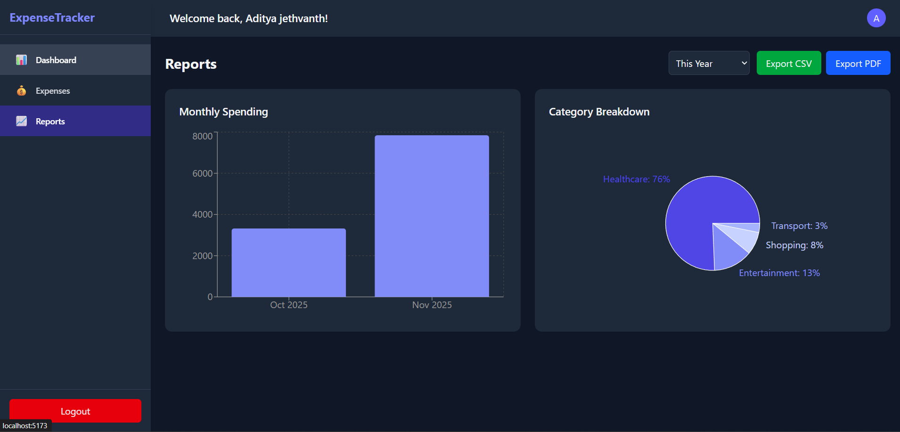

# Expense Tracker (MERN)

A production-ready expense tracker built with the MERN stack. The app supports JWT authentication, user-scoped transactions, insights via charts, CSV export, and a clean dashboard UI. Frontend is powered by React + Vite; backend by Express + MongoDB.

## Live Demo

- [](https://expense-tracker-app-theta-five.vercel.app/login)

## Screenshots

- 
  
    
    
    
 

## Features

- User authentication with JWT (Register, Login, Persist session)
- User-isolated data: each user only sees their own expenses
- CRUD for expenses (create, read, update, delete)
- Reports:
  - Monthly spending bar chart
  - Category breakdown pie chart
  - Server-side aggregation with client-side fallback
- CSV export of transactions

## Tech Stack

- Frontend: React 19, Vite, React Router, Recharts, Tailwind CSS
- Backend: Node.js, Express, Mongoose, JWT, bcrypt
- Database: MongoDB (Atlas or local)

## Monorepo Structure

```
.
├─ app/                 # Frontend (Vite + React)
└─ server/              # Backend (Express + MongoDB)
```

## Getting Started (Local)

Prerequisites
- Node.js 18+
- MongoDB connection string (Atlas or local)

### 1) Backend setup

1. Create `server/.env`:
```
MONGO_URI=YOUR_MONGODB_CONNECTION_STRING
JWT_SECRET=YOUR_STRONG_SECRET
NODE_ENV=development
PORT=5000
```
2. Install and run:
```bash
cd server
npm install
npm run server
```

### 2) Frontend setup

Optional: Create `app/.env` (defaults to the same URL if omitted):
```
VITE_API_URL=http://localhost:5000/api/v1
```

Install and run:
```bash
cd app
npm install
npm run dev
```

### 3) Run both from server concurrently (optional)

```bash
cd server
npm install
npm run dev
```

## API Overview

Base URL: `http://localhost:5000/api/v1`

- Auth
  - `POST /users/register` { name, email, password }
  - `POST /users/login` { email, password }
  - `GET /users/me` (Bearer token)

- Transactions (Bearer token required)
  - `GET /transactions` — list current user’s transactions
  - `POST /transactions` — create transaction
  - `PUT /transactions/:id` — update transaction
  - `DELETE /transactions/:id` — delete transaction
  - `GET /transactions/stats?start=ISO_STRING` — aggregated monthly and category stats for expenses

Notes
- All transaction routes are scoped to the authenticated user. The backend enforces `userid` via JWT middleware.
- Expense payload requires: `amount`, `type` ('expense' or 'income'), `category`, `description`, `date` (ISO string). UI defaults to `type: 'expense'`.

## Development Notes

- Axios is preconfigured in `app/src/services/api.js` with a request interceptor to attach the `Authorization: Bearer <token>` header.
- Frontend contexts:
  - `AuthContext` handles login/register, token persistence, and `/users/me` fetch.
  - `ExpenseContext` fetches user expenses and performs CRUD; refetches when the user changes.
- Reports fetch server-side stats and fall back to client-side computation if the server returns an empty array.

## Deployment

1. Set environment variables on your host for the backend (`MONGO_URI`, `JWT_SECRET`, `NODE_ENV=production`).
2. Serve the backend on your chosen platform (Render, Railway, Heroku, VPS, etc.).
3. Build the frontend:
```bash
cd app
npm run build
```
4. Host the contents of `app/dist` on a static host (Vercel, Netlify, Cloudflare Pages) and point it to the backend API via `VITE_API_URL` at build-time.

## Contributing

Pull requests are welcome. For major changes, please open an issue to discuss what you would like to change.

## License

MIT
